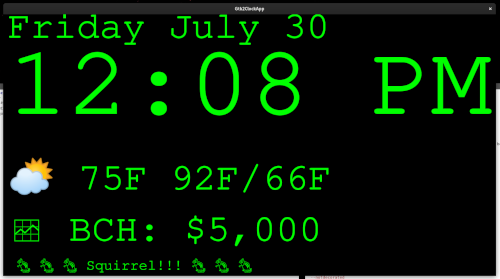
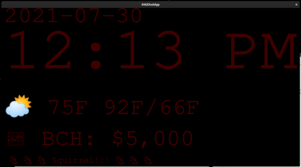

# Gtk2ClockApp

* [VERSION 2.0.210730](https://github.com/carlosjhr64/gtk2clockapp/releases)
* [github](https://github.com/carlosjhr64/gtk2clockapp)
* [rubygems](https://rubygems.org/gems/gtk2clockapp)

## DESCRIPTION:

A clock/bulletin board with a STDIN interface.

It's up to the user to wrap `gtk2clockapp` to provide additional functionality besides the clock.
It's assumes it'll get weather info, spot prices, and alerts... but
one one can put anything in those labels.

## SINOPSIS
```shell
$ gtk2clockapp
Mode: day
Weather: ⛅ 75F 92F/66F
Spot: 🗠 BCH: $5,000
 🐿 🐿 🐿 Squirrel!!! 🐿 🐿 🐿 
```

```shell
Mode: night
```

## HELP:
```
$ gtk2clockapp --help
Usage:
  gtk2clockapp [:options+]
Options:
  -h --help
  -v --version
  --fullscreen
  --notdecorated
  --size=INT         	250
  --font=NAME        	Courier
  --background=COLOR 	000000
  --day=COLOR        	00FF00
  --night=COLOR      	3F0000
Types:
  INT   /^[1-9]\d{1,2}$/
  NAME  /^[A-Z][a-z]+( w+)*$/
  COLOR /^[0-9ABCDEF]{6}$/
```
## LICENSE:

(The MIT License)

Copyright (c) 2021 CarlosJHR64

Permission is hereby granted, free of charge, to any person obtaining
a copy of this software and associated documentation files (the
'Software'), to deal in the Software without restriction, including
without limitation the rights to use, copy, modify, merge, publish,
distribute, sublicense, and/or sell copies of the Software, and to
permit persons to whom the Software is furnished to do so, subject to
the following conditions:

The above copyright notice and this permission notice shall be
included in all copies or substantial portions of the Software.

THE SOFTWARE IS PROVIDED 'AS IS', WITHOUT WARRANTY OF ANY KIND,
EXPRESS OR IMPLIED, INCLUDING BUT NOT LIMITED TO THE WARRANTIES OF
MERCHANTABILITY, FITNESS FOR A PARTICULAR PURPOSE AND NONINFRINGEMENT.
IN NO EVENT SHALL THE AUTHORS OR COPYRIGHT HOLDERS BE LIABLE FOR ANY
CLAIM, DAMAGES OR OTHER LIABILITY, WHETHER IN AN ACTION OF CONTRACT,
TORT OR OTHERWISE, ARISING FROM, OUT OF OR IN CONNECTION WITH THE
SOFTWARE OR THE USE OR OTHER DEALINGS IN THE SOFTWARE.
